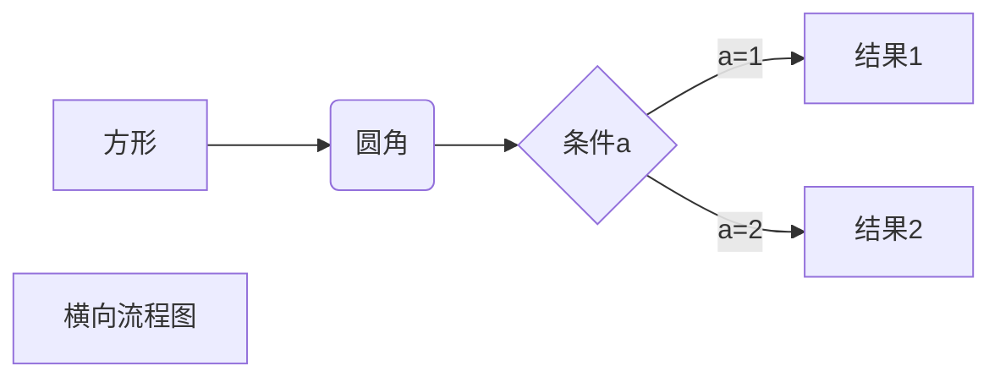

# Hello World! 
## Hello World! 
### Hello World! 
#### Hello World! 
##### Hello World! 
###### Hello World! 
- - -
~~傻逼~~

***
<u>干几包毛呢</u>

***

大傻逼[^吴骧虎]
***
* JFK是的接口
	* 积分抵扣积分
	* 分段收费和监控
	* 房价肯定数据库
* 封建时代和房价肯定是
    1. 那段疯狂的
	2. 的数据库和
* 幅度和时间环境开会
___
> 区块应用
> > 区块2
> > > 是假的回复就爱上合适的尽快哈数据库和的返回的数据客户开发  
> > > 附件是的付款即可
------
`print("傻zi")`
```javascript
$(document).ready(function () {
    alert('RUNOOB');
});
```
[故障管理](http://localhost:8089/gzgl)

这个链接用 1 作为网址变量 [Google][1]

***
|  表头   | 表头  |
|  ----  | ----  |
| 单元格  | 单元格 |
| 单元格  | 单元格 |
*****
$$
\mathbf{V}_1 \times \mathbf{V}_2 =  \begin{vmatrix} 
\mathbf{i} & \mathbf{j} & \mathbf{k} \\
\frac{\partial X}{\partial u} &  \frac{\partial Y}{\partial u} & 0 \\
\frac{\partial X}{\partial v} &  \frac{\partial Y}{\partial v} & 0 \\
\end{vmatrix}
${$tep1}{\style{visibility:hidden}{(x+1)(x+1)}}
$$
________________


[^吴骧虎]:一个大傻逼
[1]: http://www.google.com/

